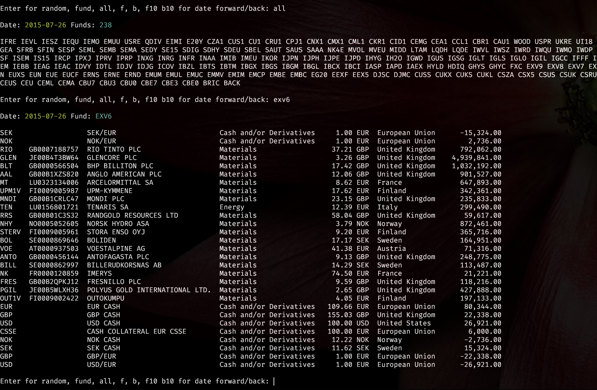

# Bitemporal Source Generator Demo
A bitemporal demo of 341 investment funds over 10 months using C# source generator to generate the data model from a schema.


## How to run the demo
```powershell
dotnet run -p Demo -c Release
```
or for 32-bit
```powershell
dotnet run -p Demo -r win-x86 -c Release
```
## Source Generator
A bitemporal source generator is created to read a schema file and create the entity types, collections and properties. It provides a good way of generating a large amount of boilerplate code to give a type safe data model.

Groups of edits are committed as transactions. In this case there is one transaction per position file and the filename is stored in the Tx entity. The data model can be queried at a Snapshot of any transaction id and then at any reporting date.

Source generators are much improved on previous code generation techniques. The best way I've found to write them is to start with an example of the required code and lay it out as a multiline string using StringBuilder with spacing, tabs and returns exactly as the output code would be formatted. Then parts of the code can be replaced with variables and templated as needed. This makes it easy to read both types of code in the [generator](Bitemporal.SourceGenerator/BitemporalGenerator.cs).
## DataSeries
DataSeries is an immutable collection representing an ordered table of Reporting Date, Transaction Id (TxId) and Varint (Vint) encoded Values with the latest at the top.

Subsequent rows are stored as the difference to the prior values stored as Vints. With [zigzag encoding](https://stackoverflow.com/questions/4533076/google-protocol-buffers-zigzag-encoding) being used for TxId and Vint as the differences can be positive or negative. 

DataSeries are represented internally as a byte array and provide both small size and quick look up for any transaction and reporting date.

This forms a [bitemporal](https://martinfowler.com/articles/bitemporal-history.html) representation of each value in the database.
| Date | TxId | Vint |
|------|------|------|
|2016-05-21|1234|100|
|2016-05-19|1201|101|
|2016-05-18|1229|103|
|2016-05-18|1189|98|

DataSeries can also represent sets well as a bitemporal sequence of add and removes.
## Fixed
These are a set of fixed decimal place numbers represented internally as a long.
As well as having no rounding error they also compress well in the DataSeries for price and quantity time series.
## Slim Collections
Bitemporal uses ListSlim, SetSlim, and MapSlim. These are increased performance and reduced memory slim append only versions of common collections that also have a useful property that they can be used lock free reading while a write is being performed.

This plus the transactional data model means concurrency is very simple and reads are self-consistent.
## Size
The database is loaded from 4.1 GB of around 70,000 position files for a large asset manager downloaded from their public website over 10 months.

The database is 63 MB saved to disk, 100 MB process memory size for 32-bit, and 130 MB for 64-bit.

This is small enough to commit to github for the demo and shows the potential to store many years of data for any asset manager or similar in memory easily.